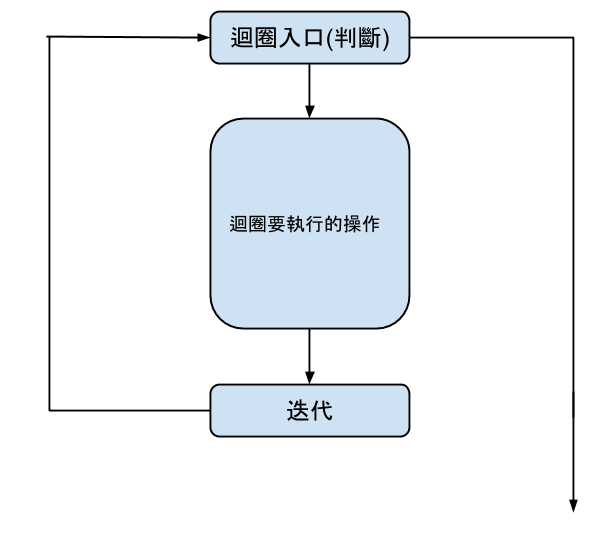
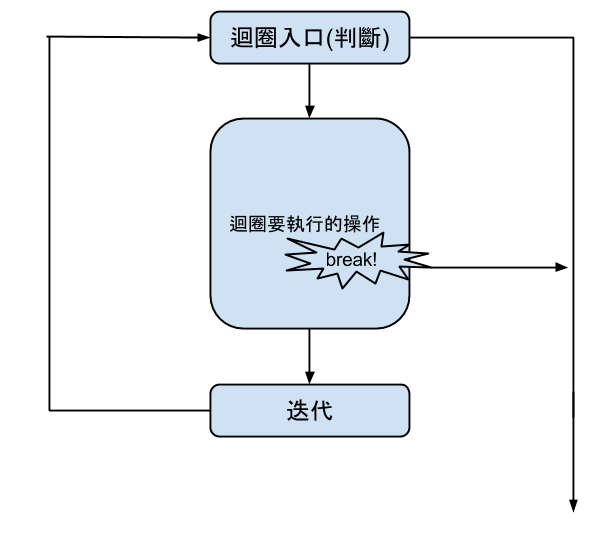
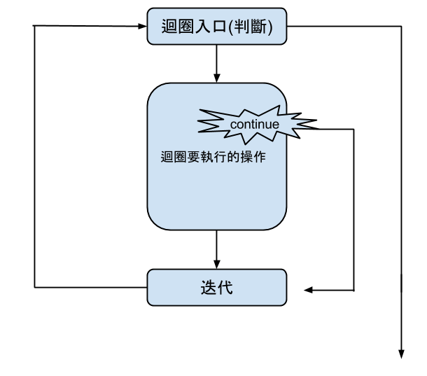

% 迴圈(II) 
% Mudream
% March 15, 2015

#

* `break`
* `continue`

#

## 回憶



#

## 質數檢驗

要如何檢驗質數？

* 回歸定義：
    
    質數定義：除了1，不被小於自己的數整除

* 虛擬碼：

    ```
    // input n
    isprime = true
    for i = 2 ~ n-1
        if n%i == 0
            isprime = false
    ```

#

## 質數檢驗

```cpp
bool isprime = true;
for(int i = 2; i < n; i++)
    if(n%i == 0)
        isprime = false;
```

#

## 質數檢驗

* 假如可以在找到因數時就離開回圈？

* 可以注意到`for`的條件部分
    
    * 假如發現他不是prime，迴圈不需要繼續跑下去
    * 增加一個條件`isprime`
    * `i < n and isprime`

    ```cpp
    bool isprime = true;
    for(int i = 2; i < n and isprime; i++)
        if(n%i == 0)
            isprime = false;
    ```

#

## 一個直接把迴圈斷掉的指令



#

## `break`指令

```cpp
bool isprime = true;
for(int i = 2;i < n; i++){
    if(n%i == 0){
        isprime = false;
        break;
    }
}
```

#

## 使用方式

* 語法：`break;`
* 意思：
    - 中斷迴圈
    - 假如是巢狀迴圈，是第一個把該指令包覆的迴圈會被中斷

    ```cpp
    for(int i = 1;i <= 3;i++){
        for(int j = 1;j <= 3;j++){
            if(j > i){
                break;
            }
            std::cout << "*";
        }
        std::cout << "\n";
    }
    ```
    
    會印出

    ```
    *
    **
    ***
    ```

#

## 跳過當前回合？



#

## `continue`指令

一個把陣列裡的正整數加起來的code

```cpp
int arr[100], sum = 0;
// Input of arr
for(int i = 0; i < 100;i++){
    if(arr[i] < 0) continue;
    sum += arr[i];
}
```

#

## 使用方法

* 語法：`continue;`
* 意思：
    - 終止當前迴圈，跳到下次迭代
    - 假如是巢狀迴圈，是第一個把該指令包覆的迴圈會被影響

# Review

* 指令：`break` `continue`
* 有時可以讓某些code更乾淨
* 想一想：
    * 有沒有辦法乾淨的方法中斷多層迴圈

#

## 練習時間！

給一個矩陣，找出第一個全是零的行的編號
